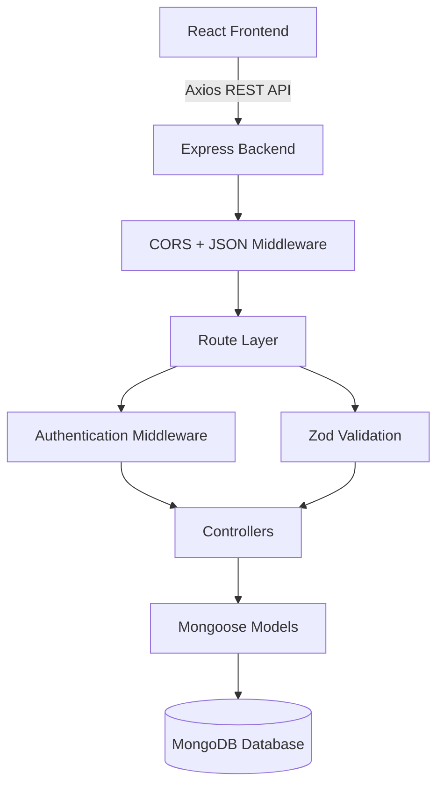

# ⚔️ Placement War-Room


## 🚀 Overview

**Placement War-Room** is a full-stack placement preparation management platform designed to help students organize, track, and optimize their technical preparation journey.

The platform combines:

- Daily goal tracking
- DSA progress monitoring
- Topic-wise coding analytics
- Personal productivity metrics
- Secure authentication

into a single workspace.

The goal is to replace scattered spreadsheets, notes, and multiple tracking tools with one centralized placement preparation dashboard.


---

# 🎯 Problem Statement

Placement preparation is usually fragmented across multiple platforms:

- LeetCode for coding progress
- Notion/Excel for tracking
- Separate notes for revision
- Reminders for daily goals

Students lack a unified system to understand:

- What they have completed
- What topics need improvement
- Whether they are maintaining consistency


Placement War-Room solves this by creating a personalized preparation command center.


---

# ✨ Features


## 🔐 Secure Authentication

- User registration and login
- Password hashing using `bcryptjs`
- JWT-based authentication
- Protected routes using authentication middleware
- Persistent login sessions


---

## 📋 Goal Management

Users can create and manage daily preparation goals.

Features:

- Create study goals
- Mark goals as completed
- Delete completed or outdated goals
- User-specific goal tracking


---

## 💻 DSA Progress Tracker

Track coding preparation in a structured way.

Features:

- Add solved coding problems
- Store:
  - Problem title
  - Topic
  - Difficulty
  - Platform
  - Problem URL
  - Revision notes

- Difficulty analytics:
  - Easy
  - Medium
  - Hard

- Topic-based progress tracking


---

## 📊 DSA Analytics Dashboard

Visualize coding progress through:

- Total solved questions
- Difficulty distribution
- Topic completion metrics
- Topic-wise targets


Example:

```
Arrays

Easy:   15/25
Medium: 10/20
Hard:    3/10

Progress: 45%
```


---

## 📈 Personalized Dashboard

Dashboard provides:

- User profile information
- Goal completion overview
- DSA progress statistics
- Preparation metrics


---

# 📸 Screenshots


## Login

(Add screenshot here)

```
screenshots/login.png
```


## Dashboard

(Add screenshot here)

```
screenshots/dashboard.png
```


## DSA Tracker

(Add screenshot here)

```
screenshots/dsa.png
```


---

# 🏗️ System Architecture





---

# 📂 Project Structure


```
placement-warroom/

│
├── backend/

│   ├── config/
│   │   └── db.js

│   ├── controllers/
│   │   ├── authController.js
│   │   ├── dashboardController.js
│   │   ├── dsaController.js
│   │   └── goalController.js

│   ├── middleware/
│   │   ├── authMiddleware.js
│   │   └── validate.js

│   ├── models/
│   │   ├── User.js
│   │   ├── Goal.js
│   │   ├── SolvedQuestion.js
│   │   └── DsaTopic.js

│   ├── routes/
│   │   ├── authRoutes.js
│   │   ├── dashboardRoutes.js
│   │   ├── dsaRoutes.js
│   │   └── goalRoutes.js

│   ├── validators/
│   │   ├── authValidator.js
│   │   ├── dsaValidator.js
│   │   └── goalValidator.js

│   └── server.js


│
├── frontend/

│   ├── src/

│   │   ├── components/
│   │   │   ├── Navbar.jsx
│   │   │   ├── StatsCard.jsx
│   │   │   ├── GoalCard.jsx
│   │   │   ├── DSAStats.jsx
│   │   │   └── TopicProgress.jsx

│   │   ├── context/
│   │   │   └── AuthContext.jsx

│   │   ├── layouts/
│   │   │   └── MainLayout.jsx

│   │   ├── pages/
│   │   │   ├── Dashboard.jsx
│   │   │   ├── DSA.jsx
│   │   │   ├── Login.jsx
│   │   │   ├── Profile.jsx
│   │   │   └── Team.jsx

│   │   ├── services/
│   │   │   └── api.js

│   │   └── App.jsx

│   └── package.json

```


---

# 📡 API Documentation


| Method | Endpoint | Authentication | Description |
|-|-|-|-|
| POST | `/api/auth/register` | ❌ | Register user |
| POST | `/api/auth/login` | ❌ | Login and receive JWT |
| GET | `/api/dashboard` | ✅ | Fetch dashboard statistics |
| GET | `/api/goals` | ✅ | Get user goals |
| POST | `/api/goals` | ✅ | Create goal |
| PUT | `/api/goals/:id` | ✅ | Toggle goal status |
| DELETE | `/api/goals/:id` | ✅ | Delete goal |
| POST | `/api/dsa/question` | ✅ | Add solved question |
| GET | `/api/dsa/questions` | ✅ | Fetch solved questions |
| GET | `/api/dsa/topics` | ✅ | Fetch topic analytics |
| DELETE | `/api/dsa/question/:id` | ✅ | Delete solved question |


Protected routes require:

```
Authorization: Bearer <JWT_TOKEN>
```


---

# ⚙️ Installation


## Prerequisites

- Node.js
- MongoDB Atlas or Local MongoDB


---

## Clone Repository

```bash
git clone https://github.com/<username>/placement-warroom.git

cd placement-warroom
```


---

# Backend Setup


```bash
cd backend

npm install
```


Create `.env`

```env
PORT=5000

MONGO_URI=your_mongodb_connection_string

JWT_SECRET=your_secret_key
```


Run backend:

```bash
npm run dev
```


Backend runs on:

```
http://localhost:5000
```


---

# Frontend Setup


```bash
cd frontend

npm install

npm run dev
```


Frontend runs on:

```
http://localhost:5173
```


---

# 🛠️ Tech Stack


## Frontend

- React 19
- Vite
- Tailwind CSS
- React Router
- Axios


## Backend

- Node.js
- Express.js
- JWT Authentication
- bcryptjs
- Zod Validation


## Database

- MongoDB
- Mongoose ODM


---

# 🛣️ Roadmap


## Completed

✅ Authentication system

✅ Protected routes

✅ Goal tracking

✅ DSA tracker

✅ Topic analytics


## Planned

⬜ Study hour tracking

⬜ Automated streak calculation

⬜ Interview preparation tracker

⬜ Resume analyzer

⬜ AI placement mentor

⬜ Team leaderboard


---

# 👨‍💻 Author


Developed by **Vartika Pandey**

A full-stack engineering project built to improve placement preparation through structured tracking, analytics, and accountability.

