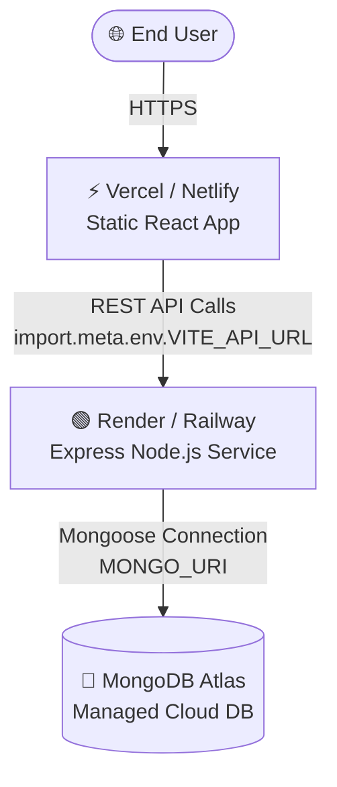

# 🚀 Placement War-Room Deployment Plan

This document outlines the deployment strategy, architecture, and step-by-step instructions to deploy the **Placement War-Room** application to production.

---

## 🏗️ Production Architecture

We recommend a **Split-Hosting Architecture** because it optimizes performance, keeps hosting costs low (or free), and scales components independently.



---

## 📊 Deployment Strategy Comparison

Below is a comparison of hosting strategies suitable for the **Placement War-Room**:

| Strategy | Frontend | Backend | Database | Pros | Cons | Best For |
| :--- | :--- | :--- | :--- | :--- | :--- | :--- |
| **Split-Hosting**<br>*(Recommended)* | Vercel or Netlify | Render or Railway | MongoDB Atlas (Free Tier) | • Fast global static CDN<br>• Automated preview deploys<br>• Free tier covers moderate use | • Spin-up delay on Render free tier (cold starts)<br>• Requires CORS configuration | Personal projects, portfolio demos, cost efficiency. |
| **Unified PaaS** | Render (Static) | Render (Web Service) | MongoDB Atlas | • Single dashboard for all services<br>• Simple environment config | • Frontend and backend cold starts on free tier | Simplicity of managing all services in one place. |
| **Self-Hosted VPS** | Nginx / Docker | PM2 / Docker | Docker / Local MongoDB | • Full control over resources<br>• No cold starts<br>• Cheap for large scale | • Manual security management<br>• No automatic CDN or builds<br>• Harder setup | Production team usage, private server instances. |

---

## 🔑 Environment Variables Checklist

Ensure these variables are configured correctly in your respective hosting environments:

### 🟢 Backend (Express Service)
| Variable | Description | Example / Recommended Value |
| :--- | :--- | :--- |
| `PORT` | Listening port for Express | `5000` (Render will inject this dynamically) |
| `NODE_ENV` | Mode of operation | `production` |
| `MONGO_URI` | MongoDB Atlas connection string | `mongodb+srv://<user>:<password>@cluster.mongodb.net/placement-warroom` |
| `JWT_SECRET` | Secret key for signing Auth tokens | *A strong random string (e.g., generated with `openssl rand -base64 32`)* |

### ⚡ Frontend (Vite Static Site)
| Variable | Description | Example / Recommended Value |
| :--- | :--- | :--- |
| `VITE_API_URL` | Base URL of the deployed Express backend | `https://placement-warroom-api.onrender.com/api` (no trailing slash) |

---

## 🏁 Step-by-Step Deployment Guide

### Phase 1: Database Setup (MongoDB Atlas)
1. Sign up/Log in to [MongoDB Atlas](https://www.mongodb.com/cloud/atlas).
2. Create a new Shared Cluster (Free Tier) named `placement-warroom`.
3. In **Database Access**, create a database user with a secure password and `Read and write to any database` permissions.
4. In **Network Access**, add a whitelist entry:
   - For initial testing, you can add `0.0.0.0/0` (allow access from anywhere, required for platforms like Render unless using static IPs).
   - Alternatively, configure a VPC peering or update to specific IP ranges if using dedicated backend host plans.
5. Retrieve your connection string from the cluster connection panel under **Connect > Drivers** and replace `<db_password>` with your database user password.

---

### Phase 2: Backend Deployment (Render)
1. Sign up/Log in to [Render](https://render.com/).
2. Click **New +** and select **Web Service**.
3. Connect your GitHub repository.
4. Set the following options:
   - **Name**: `placement-warroom-backend`
   - **Root Directory**: `backend`
   - **Language**: `Node`
   - **Build Command**: `npm install`
   - **Start Command**: `node server.js`
5. Click **Advanced** and add the environment variables:
   - `NODE_ENV` = `production`
   - `MONGO_URI` = *(your MongoDB connection string from Phase 1)*
   - `JWT_SECRET` = *(your generated secret key)*
6. Deploy the service. Note down the provided service URL (e.g., `https://placement-warroom-backend.onrender.com`).

---

### Phase 3: Frontend Deployment (Vercel)
1. Sign up/Log in to [Vercel](https://vercel.com).
2. Click **Add New** and select **Project**.
3. Import your GitHub repository.
4. Configure the Project settings:
   - **Framework Preset**: `Vite` (automatically detected)
   - **Root Directory**: `frontend`
   - **Build Command**: `npm run build`
   - **Output Directory**: `dist`
5. Under **Environment Variables**, add:
   - **Key**: `VITE_API_URL`
   - **Value**: `https://<your-render-backend-url>/api` (make sure it includes `/api` at the end)
6. Click **Deploy**. Vercel will build and host your frontend globally.

---

## 🔒 Production Enhancements & Recommendations

> [!IMPORTANT]
> The current backend configuration has wide-open CORS enabled via `app.use(cors())`. For security in production, restrict CORS to only allow requests from your frontend domain.

### Recommended Backend CORS Update
In [`backend/server.js`](file:///c:/Users/Vartika/Documents/placement-warrrom/backend/server.js), restrict requests using an environment variable for the allowed origin:

```javascript
// Replace app.use(cors()) with:
const allowedOrigin = process.env.ALLOWED_ORIGIN || "http://localhost:5173";
app.use(cors({
  origin: allowedOrigin,
  credentials: true
}));
```

Make sure to set the `ALLOWED_ORIGIN` environment variable in your Render backend settings to your Vercel frontend URL (e.g., `https://placement-warroom.vercel.app`).

---

## 🧪 Post-Deployment Verification Checklist

Once both services are deployed, perform the following validation:

- [ ] **Health Check**: Open the backend URL in a browser (`https://your-backend.onrender.com/`). It should display: `Placement War-Room Backend Running`.
- [ ] **Frontend Load**: Navigate to the Vercel app URL. Verify that pages load without errors.
- [ ] **Registration & Login**: Create a new account. Confirm that it registers successfully and redirects to the dashboard (checks MongoDB connection and JWT token generation).
- [ ] **Data Retention**: Add a daily goal or solved coding problem, log out, log back in, and ensure your data persists (checks Mongoose model schemas and database writes).
- [ ] **Network Inspectors**: Inspect the browser console network tab on requests to verify that no requests fall back to `localhost:5000`.
