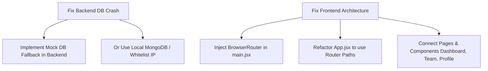

# Placement War-Room: Extensive Project & Feature Analysis

This report is a comprehensive assessment of the **Placement War-Room** application. It details the current state of the architecture, analyzes existing vs. planned features, flags implementation discrepancies, reports local running diagnostics, and details an action plan to get the system fully operational.

---

## 1. Project Directory & Architecture Overview

The codebase is organized into two main systems: a frontend single-page React app and a Node.js/Express backend server.

```
placement-warroom/
├── backend/                   # REST API & DB Layer
│   ├── config/                # DB connection settings (db.js)
│   ├── controllers/           # Controller handlers (currently empty)
│   ├── middleware/            # JWT validation (authMiddleware.js)
│   ├── models/                # MongoDB/Mongoose schemas (User.js, Goal.js)
│   ├── routes/                # Express router paths (authRoutes.js, goalRoutes.js)
│   └── server.js              # Entry node server
│
└── frontend/                  # React Application
    ├── public/                # Static assets
    ├── src/
    │   ├── components/        # Reusable UI widgets
    │   │   ├── GoalCard.jsx   # Card displaying single goal (completed/delete actions)
    │   │   ├── Navbar.jsx     # Navigation bar containing Router Link objects
    │   │   ├── StatsCard.jsx  # Metric indicator card (e.g. Streaks, Hours)
    │   │   └── TeamMember.jsx # Leaderboard ranking indicator
    │   ├── pages/             # Route-level view assemblies
    │   │   ├── Dashboard.jsx  # Today's goals, stats grids, and inputs
    │   │   ├── Login.jsx      # Styling template for auth
    │   │   ├── Profile.jsx    # User statistics card
    │   │   └── Team.jsx       # Static peer leaderboard
    │   ├── App.jsx            # Application controller & state coordinator
    │   ├── App.css            # Custom CSS styles
    │   ├── index.css          # Tailwind CSS v4 import wrapper
    │   └── main.jsx           # DOM mounting entrypoint
    ├── package.json           # Frontend configurations & build files
    └── vite.config.js         # Vite configuration with Tailwind CSS plugin
```

---

## 2. In-Depth Feature Review

The features of the application are classified into **Implemented**, **In-Progress**, and **Planned** based on code reviews and project roadmap guides:

### A. Currently Implemented Features

* **Goal CRUD Operations (Functional)**: 
  * Users can dynamically create daily study goals.
  * Users can toggle completion status (styled with a `line-through` strike and status emojis).
  * Users can permanently delete goals from their list.
* **User Authentication APIs (Functional)**:
  * Backend endpoints are fully coded for registering users with hashed passwords (`bcryptjs`).
  * Backend login issues 7-day JSON Web Tokens (JWT) for session maintenance.
  * Local storage checks token validation on mount in `App.jsx`.
* **State Management System (Functional)**:
  * Employs React functional state (`useState`) and lifecycle side-effects (`useEffect`) to fetch/update backend API data.
* **Responsive Visual Styling (Functional)**:
  * Modern, dark-blue themed dark mode UI designed with vanilla CSS (`App.css`) and Tailwind CSS v4.0 elements.

---

### B. In-Progress Features (Coded but Unintegrated)

* **Multi-Page Page Modularization**:
  * Individual UI modules for the `Dashboard`, static `Team` leaderboard, static `Profile` card, and `Login` form templates exist under `frontend/src/pages/` and `frontend/src/components/`.
  * **Status**: Coded but bypassed. The application current runtime executes a singular monolithic rendering block in `App.jsx`, leaving these pages disconnected.
* **Leaderboard Display**:
  * UI is mock-constructed inside `Team.jsx` utilizing `TeamMember.jsx` components displaying hardcoded profiles (e.g., Vartika, Aman, Riya).
  * **Status**: Coded but static; lacks backend connection.

---

### C. Planned Features (Need to be Added)

* **Frontend Routing Integration (Immediate Need)**:
  * Set up React Router DOM inside `App.jsx` using `BrowserRouter`, `Routes`, `Route`, and `<Navbar />` to coordinate paths:
    * `/` $\rightarrow$ `Dashboard`
    * `/team` $\rightarrow$ `Team Page`
    * `/profile` $\rightarrow$ `Profile Page`
    * `/login` $\rightarrow$ `Login Page`
* **Real-time Team Synchronization (Future Phase)**:
  * Implement WebSockets or Socket.io to synchronize goals and scores live across small accountability peer teams.
* **Persistent Daily Streak Systems (Future Phase)**:
  * Compute and persist consecutive study streaks on the backend based on goal completion dates.
* **Contest & Roadmaps Trackers (Future Phase)**:
  * Fetch and display coding contest data (LeetCode, Codeforces API) and track syllabus roadmaps (DSA, OOP, OS, CN).
* **Mock Interview Scheduling (Future Phase)**:
  * Implement interview bookings and review metrics for accountability groups.

---

## 3. Implementation Discrepancy (Code vs. Docs)

The project documentation (such as `docs/ROUTING_SYSTEM.md`) outlines a client-side routing structure featuring modular components. However:

1. **Routing is Completely Missing**: There is no router context imported or configured in `App.jsx` or `main.jsx`.
2. **Page Views are Bypassed**: Page files (`Dashboard.jsx`, `Team.jsx`, `Profile.jsx`) sit idle. Instead, `App.jsx` handles all HTML generation for the Dashboard and Login views itself, copying and duplicating the layout.
3. **No Dynamic Navigation**: The navigation system is unusable because `Navbar.jsx` cannot resolve standard routing contexts without a parent `<BrowserRouter>`.

---

## 4. Local Run Diagnostics & Database Crashing

To prepare for launching, we initiated both subsystems:

### Frontend
* **Status**: `RUNNING` ✅
* **URL**: [http://localhost:5173/](http://localhost:5173/)
* **Vite + Tailwind Build**: Compiles correctly.

### Backend
* **Status**: `CRASHED` ❌
* **Port**: `5000`
* **Root Cause**: The `.env` file references a remote MongoDB Atlas cluster. When Mongoose tries to connect on start, it fails with a `MongooseServerSelectionError` because the user's current network IP is not whitelisted in the remote Atlas cluster's firewall:
  ```
  Database Connection Error
  MongooseServerSelectionError: Could not connect to any servers in your MongoDB Atlas cluster.
  ```
  As a result, the server process calls `process.exit(1)`, crashing `nodemon` instantly.

---

## 5. Recommended Technical Action Plan

To establish a fully functional local development environment, we should carry out the following fixes:



### Action 1: Write a Mock Database / JSON Fallback for Backend
To enable instant local execution without external database setups or network configurations:
* Implement an offline JSON-file storage controller (e.g. `mock_db.json`) inside the backend database connector ([db.js](file:///c:/Users/Vartika/Documents/placement-warrrom/backend/config/db.js)).
* If the remote MongoDB connection throws an error, the backend prints a warning and automatically falls back to the JSON store instead of crashing.

### Action 2: Standardize Frontend Routing in `App.jsx`
Restore the architecture detailed in the docs:
* Wrap the React root in `<BrowserRouter>` inside [main.jsx](file:///c:/Users/Vartika/Documents/placement-warrrom/frontend/src/main.jsx).
* Refactor [App.jsx](file:///c:/Users/Vartika/Documents/placement-warrrom/frontend/src/App.jsx) to mount `<Navbar />` and a `<Routes>` switch routing to `<Dashboard />`, `<Team />`, `<Profile />`, and `<Login />`.
* Pass state modifiers (`goals`, `addGoal`, `deleteGoal`, `toggleGoal`) as React props to the page handlers.
